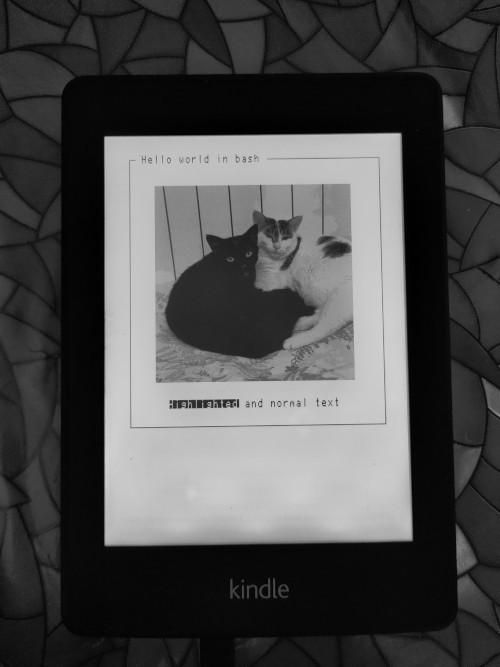

# Bash hello world

This example leverages the usage of `eips`, a program included on all kindles by default.

## How to run
- Connect the kindle to USB and mount storage
- Copy the files in a folder into the kindle, i.e.: `Kindle storage/documents/kindle_app_hello_world`
- Umount storage and disconnect USB cable
- Use a terminal (kterm or USBNetwork) to run the .sh file:
```
cd /mnt/us/documents/kindle_app_hello_world/
./main.sh
```

## eips command line arguments:
```
usage:
to print strings: eips [row] [col] [-h] string
                 -h for highlighted text
to show image: eips -g|-b image_path [-w waveform -f -x xpos -y ypos -v]
                 -g for png, -b for bitmap
                 -w waveform can be gc16 gl16 or du, default is gc16
                 -f for full update, default is partial update
                 -x -y in units of pixels
                 -v for inverted picture
to paint a retangle on screen: eips -d l=a,w=b,h=c [-x xx -y yy -w wf]
                 a is gray level in hex, b is width, c is height, with optional xx yy location, waveform mode
to clear display: eips -c
to paint checker: eips -q
to paint grayscale: eips -l
to paint pattern: eips -p
to paint barcode: eips -r barcode
to print fb info: eips -i
```

## Screeshots

